# GitHub Copilot for Systems & Business Analysts - Lab Repository

## Training Overview
**Duration:** 75 minutes  
**Audience:** Systems Analysts, Business Analysts, Functional Analysts  
**Focus:** Using GitHub Copilot to accelerate analysis tasks, NOT coding

## Prerequisites
- VS Code with GitHub Copilot Chat extension
- SQLite or DB Browser for SQLite (optional)
- Basic SQL knowledge
- Understanding of business requirements documentation
- **No programming experience required!**

## Lab Objectives
1. **Prompt Engineering** - Master the RIFCC framework (Role, Inputs, Format, Constraints, Checks)
2. **Legacy System Analysis** - Understand and document COBOL/JCL systems
3. **Data Analysis Automation** - Convert Excel formulas to SQL queries
4. **Governance & Validation** - Identify and correct AI-generated errors

## Repository Contents
- `/data/` - Sample datasets (synthetic data only)
- `/legacy/` - COBOL/JCL files for analysis
- `/templates/` - Documentation templates
- `/exercises/` - Practice exercises with intentional errors
- `/outputs/` - Your generated artifacts go here
- `/reference/` - Quick reference guides

---

## Learning Path

```mermaid
graph LR
    A[📖 Read README] --> B[🚀 Quick Start]
    B --> C[📚 RIFCC Framework]
    C --> D[🔍 Data Analysis]
    D --> E[💼 COBOL Analysis]
    E --> F[🛡️ Error Detection]
    F --> G[📝 Documentation]
    G --> H[✅ Complete!]
    
    style A fill:#e1f5ff
    style B fill:#e1f5ff
    style C fill:#fff4e1
    style D fill:#ffe1f5
    style E fill:#ffe1f5
    style F fill:#ffe1f5
    style G fill:#e1ffe1
    style H fill:#e1ffe1
```



## Recommended Sequence

### 🎯 Phase 1: Get Ready (5-10 minutes)
1. 📖 **Read This**: README.md (you are here!)
2. 🚀 **New to Copilot?**: Read [QUICK_START.md](QUICK_START.md)
3. 📚 **Learn Prompting**: Review [reference/RIFCC_FRAMEWORK.md](reference/RIFCC_FRAMEWORK.md)
4. ✅ **Safety First**: Review [VERIFY_BEFORE_SEND.md](VERIFY_BEFORE_SEND.md)

### 🔍 Phase 2: Practice Data Analysis (15 minutes)
1. Open `data/transactions.csv` and `data/customers.csv`
2. Use Copilot to identify data quality issues
3. Generate SQL queries for business questions
4. Document findings in `outputs/DATA_NOTES.md`

**Sample Prompt:**
```
"Analyze data/transactions.csv and identify all data quality issues. 
For each issue, provide: description, count, impact, and recommended fix."
```

### 💼 Phase 3: Decode Legacy Systems (15 minutes)
1. Open `legacy/fees_calc.cob`
2. Use Copilot to extract business rules in plain English
3. Create decision tables showing fee calculations
4. Document risks and modernization opportunities
5. Save to `outputs/REQ_Logic.md` and `outputs/RISK_Register.md`

**Sample Prompt:**
```
"Acting as a business analyst, explain legacy/fees_calc.cob in plain English:
1. What are the inputs and outputs?
2. What business rules are implemented?
3. What are the key calculations?"
```

### 🛡️ Phase 4: Validate AI Outputs (15 minutes)
1. Review `exercises/flawed_sql_example.sql`
2. Use Copilot to identify all 6 errors
3. Review `exercises/flawed_analysis.md` for logical errors
4. Fix bugs in `exercises/flawed_join_logic.py`

**Sample Prompt:**
```
"Review exercises/flawed_sql_example.sql and identify all errors. 
For each error, explain: what's wrong, why it's wrong, and the corrected version."
```

### 📝 Phase 5: Create Documentation (20 minutes)
1. Use templates in `/templates/` directory
2. Fill out at least 3 documentation templates
3. Save all work to `/outputs/` directory
4. Review your work against success criteria

---

## Getting Started

### Step 1: Open Copilot Chat
- Press `Ctrl+Shift+I` (Windows/Linux) or `Cmd+Shift+I` (Mac)
- Or click the Copilot Chat icon in VS Code sidebar

### Step 2: Test Your Setup
Try this prompt:
```
"List all files in the /legacy/ directory and explain what each one does"
```

### Step 3: Follow the Guide
Open [SESSION_GUIDE.md](SESSION_GUIDE.md) for detailed instructions and sample prompts.

---

## Key Files to Know

| File | Purpose | When to Use |
|------|---------|-------------|
| `QUICK_START.md` | Copilot basics for beginners | First time using Copilot? Start here! |
| `SESSION_GUIDE.md` | 75-minute session timeline | Your main guide during the lab |
| `VERIFY_BEFORE_SEND.md` | Data privacy checklist | Before sending any prompts |
| `INSTRUCTOR_GUIDE.md` | Expected outcomes & answers | For instructors only |
| `reference/RIFCC_FRAMEWORK.md` | Advanced prompting techniques | To improve prompt quality |
| `reference/COPILOT_COMMANDS.md` | Copilot command reference | Quick command lookup |
| `reference/GLOSSARY.md` | Technical terms explained | When you see unfamiliar terms |

---

## What You'll Learn

By completing this lab, you will be able to:

✅ Write effective prompts using the RIFCC framework  
✅ Use Copilot to analyze data quality issues  
✅ Extract business rules from legacy COBOL code  
✅ Generate SQL queries from business requirements  
✅ Create professional documentation (requirements, data maps, risk registers)  
✅ Identify and correct errors in AI-generated content  
✅ Apply governance principles to AI-assisted analysis  

---

## Success Criteria

### You're done when you have:
- [ ] Identified 8+ data quality issues in transactions.csv
- [ ] Extracted 5+ business rules from COBOL programs
- [ ] Created a decision table for fee calculations
- [ ] Found all 6 errors in flawed SQL examples
- [ ] Written 3+ SQL queries validated against sample data
- [ ] Filled out at least 3 templates in `/outputs/`
- [ ] Documented assumptions and validation steps

See [SESSION_GUIDE.md](SESSION_GUIDE.md) for complete checklist.

---

## Important Reminders

⚠️ **Data Privacy**: Use ONLY the synthetic data provided. Never paste real customer data into Copilot.

⚠️ **Validation**: Always verify Copilot's output. AI can make mistakes!

⚠️ **Documentation**: Document your assumptions and validation steps.

⚠️ **Ask Questions**: Iterate on prompts to get better results.

---

## Need Help?

- **First time with Copilot?** → Read `QUICK_START.md`
- **Stuck on a prompt?** → Check `reference/RIFCC_FRAMEWORK.md`
- **Don't understand COBOL terms?** → See `reference/GLOSSARY.md`
- **Want better results?** → Review sample prompts in `SESSION_GUIDE.md`

---

## Ready to Begin?

👉 **Next Step:** Open [QUICK_START.md](QUICK_START.md) or jump straight to [SESSION_GUIDE.md](SESSION_GUIDE.md)

Good luck! 🚀
