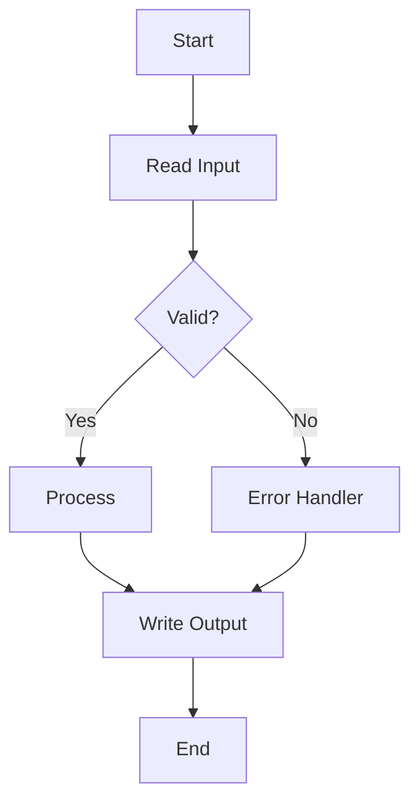

# Claude Code Instructions: Generate GitHub Copilot Lab Repository for Systems & Business Analysts

## Overview
Create a complete training lab repository for Systems and Business Analysts learning GitHub Copilot. Focus on business analysis tasks, legacy system understanding, data analysis, and requirements documentation - NOT on programming.

## Repository Creation Instructions

### Step 1: Initialize Repository Structure

Create a new repository called `copilot-analyst-lab` with the following structure:

```
copilot-analyst-lab/
├── README.md
├── .gitignore
├── SESSION_GUIDE.md
├── VERIFY_BEFORE_SEND.md
├── /data/
├── /legacy/
├── /templates/
├── /exercises/
├── /outputs/
└── /reference/
```

### Step 2: Generate Root Files

#### 2.1 Create README.md
```markdown
# GitHub Copilot for Systems & Business Analysts - Lab Repository

## Training Overview
**Duration:** 75 minutes  
**Audience:** Systems Analysts, Business Analysts, Functional Analysts  
**Focus:** Using GitHub Copilot to accelerate analysis tasks, NOT coding

## Prerequisites
- VS Code with GitHub Copilot Chat extension
- SQLite or DB Browser for SQLite
- Basic SQL knowledge
- Understanding of business requirements documentation

## Lab Objectives
1. **Prompt Engineering** - Master the RIFCC framework (Role, Inputs, Format, Constraints, Checks)
2. **Legacy System Analysis** - Understand and document COBOL/JCL systems
3. **Data Analysis Automation** - Convert Excel formulas to SQL queries
4. **Governance & Validation** - Identify and correct AI-generated errors

## Repository Contents
- `/data/` - Sample datasets (synthetic data only)
- `/legacy/` - COBOL/JCL files for analysis
- `/templates/` - Documentation templates
- `/exercises/` - Practice exercises with intentional errors
- `/outputs/` - Your generated artifacts go here
- `/reference/` - Quick reference guides

## Getting Started
1. Open this repository in VS Code
2. Ensure GitHub Copilot Chat is active
3. Start with SESSION_GUIDE.md
4. Use templates in `/templates/` for documentation
5. Save all outputs to `/outputs/` directory
```

#### 2.2 Create .gitignore
```
# Ignore sensitive data
*.xlsx
*.xls
*_real_data.*
*_production.*
*_sensitive.*

# Ignore temporary files
*.tmp
*.bak
~*

# OS files
.DS_Store
Thumbs.db

# VS Code
.vscode/settings.json

# Output files during training
/outputs/*.draft.*
```

#### 2.3 Create VERIFY_BEFORE_SEND.md (Template)
```markdown
# Verify-Before-Send Checklist

## Data Privacy Checks
- [ ] No PII (names, SSNs, emails, phone numbers) in prompts
- [ ] No real company data used
- [ ] Only synthetic/sample data in examples
- [ ] No proprietary business logic exposed

## Output Validation
- [ ] Generated SQL tested on sample data
- [ ] Business logic matches requirements
- [ ] Edge cases considered
- [ ] Numbers/calculations verified independently

## Documentation Quality
- [ ] Assumptions clearly stated
- [ ] Sources cited where applicable
- [ ] Limitations acknowledged
- [ ] Business context provided

## Add Your Team-Specific Checks Below:
1. _________________
2. _________________
3. _________________
```

### Step 3: Create /data/ Directory Contents

#### 3.1 Generate transactions.csv (500 rows of synthetic data)
Create a CSV with these columns:
- transaction_id (T001-T500)
- date (2024-01-01 to 2024-10-31)
- customer_id (C001-C050)
- product_category (Electronics, Clothing, Food, Services, Other)
- amount (random between 10.00 and 5000.00)
- status (Completed, Failed, Pending, Refunded)
- payment_method (Credit, Debit, Cash, Wire, Other)
- region (North, South, East, West, Central)

Include some data quality issues:
- 5% missing values in random cells
- Some duplicate transaction_ids (T101, T205, T367)
- A few negative amounts
- Some dates in wrong format

#### 3.2 Generate customers.csv (50 rows)
Columns:
- customer_id (C001-C050)
- company_name (Generic Company 1-50)
- tier (Gold, Silver, Bronze)
- annual_revenue (random 100K-10M)
- region (North, South, East, West, Central)
- account_manager (AM01-AM05)

#### 3.3 Create schema.sql
```sql
-- Schema documentation for analyst reference
-- This represents the target modern database structure

CREATE TABLE transactions (
    transaction_id VARCHAR(10) PRIMARY KEY,
    transaction_date DATE NOT NULL,
    customer_id VARCHAR(10) NOT NULL,
    product_category VARCHAR(50),
    amount DECIMAL(10,2),
    status VARCHAR(20),
    payment_method VARCHAR(20),
    region VARCHAR(20),
    FOREIGN KEY (customer_id) REFERENCES customers(customer_id)
);

CREATE TABLE customers (
    customer_id VARCHAR(10) PRIMARY KEY,
    company_name VARCHAR(100) NOT NULL,
    tier VARCHAR(20),
    annual_revenue DECIMAL(12,2),
    region VARCHAR(20),
    account_manager VARCHAR(10)
);

-- Sample business rules to implement:
-- 1. Gold tier customers get 10% discount on amounts > 1000
-- 2. Failed transactions should trigger alert if > 500
-- 3. Regional rollups calculated monthly
```

### Step 4: Create /legacy/ Directory Contents

#### 4.1 Generate fees_calc.cob (COBOL program)
```cobol
       IDENTIFICATION DIVISION.
       PROGRAM-ID. FEES-CALC.
       AUTHOR. LEGACY-SYSTEM.
       DATE-WRITTEN. 1995-03-15.
      ******************************************************************
      * PURPOSE: CALCULATE TRANSACTION FEES BASED ON COMPLEX RULES    *
      * LAST MODIFIED: 2003-07-22 - ADDED TIER DISCOUNTS            *
      ******************************************************************
       
       ENVIRONMENT DIVISION.
       INPUT-OUTPUT SECTION.
       FILE-CONTROL.
           SELECT TRANS-FILE ASSIGN TO "TRANS.DAT"
               ORGANIZATION IS SEQUENTIAL.
           SELECT FEES-FILE ASSIGN TO "FEES.DAT"
               ORGANIZATION IS SEQUENTIAL.
       
       DATA DIVISION.
       FILE SECTION.
       FD  TRANS-FILE.
       01  TRANS-RECORD.
           05  TR-ID           PIC X(10).
           05  TR-DATE         PIC 9(8).
           05  TR-CUST-ID      PIC X(10).
           05  TR-AMOUNT       PIC S9(7)V99 COMP-3.
           05  TR-TYPE         PIC X(2).
               88  CREDIT-TRANS    VALUE "CR".
               88  DEBIT-TRANS     VALUE "DB".
               88  WIRE-TRANS      VALUE "WR".
           05  TR-TIER         PIC X(1).
               88  GOLD-TIER       VALUE "G".
               88  SILVER-TIER     VALUE "S".
               88  BRONZE-TIER     VALUE "B".
       
       FD  FEES-FILE.
       01  FEES-RECORD.
           05  FE-ID           PIC X(10).
           05  FE-BASE-FEE     PIC S9(5)V99 COMP-3.
           05  FE-DISC-FEE     PIC S9(5)V99 COMP-3.
           05  FE-FINAL-FEE    PIC S9(5)V99 COMP-3.
       
       WORKING-STORAGE SECTION.
       01  WS-COUNTERS.
           05  WS-TRANS-COUNT  PIC 9(6) VALUE ZERO.
           05  WS-ERROR-COUNT  PIC 9(4) VALUE ZERO.
       
       01  WS-CALCULATIONS.
           05  WS-BASE-RATE    PIC 9V999 VALUE 0.025.
           05  WS-TIER-DISC    PIC 9V99.
           05  WS-VOLUME-ADJ   PIC 9V99.
       
       01  WS-FLAGS.
           05  WS-EOF          PIC X VALUE 'N'.
       
       PROCEDURE DIVISION.
       MAIN-PROCESS.
           PERFORM INIT-PROCESS
           PERFORM PROCESS-TRANSACTIONS UNTIL WS-EOF = 'Y'
           PERFORM CLOSE-PROCESS
           STOP RUN.
       
       INIT-PROCESS.
           OPEN INPUT TRANS-FILE
           OPEN OUTPUT FEES-FILE
           PERFORM READ-TRANS.
       
       PROCESS-TRANSACTIONS.
           PERFORM CALCULATE-BASE-FEE
           PERFORM APPLY-TIER-DISCOUNT
           PERFORM APPLY-VOLUME-ADJUSTMENT
           PERFORM WRITE-FEE-RECORD
           PERFORM READ-TRANS.
       
       CALCULATE-BASE-FEE.
           IF CREDIT-TRANS
               COMPUTE FE-BASE-FEE = TR-AMOUNT * WS-BASE-RATE
           ELSE IF DEBIT-TRANS
               COMPUTE FE-BASE-FEE = TR-AMOUNT * (WS-BASE-RATE * 0.8)
           ELSE IF WIRE-TRANS
               COMPUTE FE-BASE-FEE = TR-AMOUNT * (WS-BASE-RATE * 1.5)
                   + 25.00
           ELSE
               COMPUTE FE-BASE-FEE = TR-AMOUNT * WS-BASE-RATE.
       
       APPLY-TIER-DISCOUNT.
           IF GOLD-TIER
               MOVE 0.20 TO WS-TIER-DISC
           ELSE IF SILVER-TIER
               MOVE 0.10 TO WS-TIER-DISC
           ELSE
               MOVE 0.00 TO WS-TIER-DISC
           END-IF
           COMPUTE FE-DISC-FEE = FE-BASE-FEE * (1 - WS-TIER-DISC).
       
       APPLY-VOLUME-ADJUSTMENT.
      *    Complex volume calculation - monthly aggregate affects rate
           IF TR-AMOUNT > 10000
               COMPUTE FE-FINAL-FEE = FE-DISC-FEE * 0.95
           ELSE IF TR-AMOUNT > 5000
               COMPUTE FE-FINAL-FEE = FE-DISC-FEE * 0.98
           ELSE
               MOVE FE-DISC-FEE TO FE-FINAL-FEE.
           
           MOVE TR-ID TO FE-ID.
       
       WRITE-FEE-RECORD.
           WRITE FEES-RECORD
           ADD 1 TO WS-TRANS-COUNT.
       
       READ-TRANS.
           READ TRANS-FILE
               AT END MOVE 'Y' TO WS-EOF.
       
       CLOSE-PROCESS.
           DISPLAY "TRANSACTIONS PROCESSED: " WS-TRANS-COUNT
           CLOSE TRANS-FILE
           CLOSE FEES-FILE.
```

#### 4.2 Generate job_stream.jcl
```jcl
//FEESCALC JOB (ACCT),'DAILY FEE CALC',CLASS=A,MSGCLASS=X,
//         NOTIFY=&SYSUID,REGION=4M
//*
//* *********************************************************
//* DAILY TRANSACTION FEE CALCULATION JOB STREAM
//* RUNS: DAILY AT 02:00 AM
//* DEPENDENCIES: TRANS EXTRACT MUST COMPLETE FIRST
//* *********************************************************
//*
//STEP010  EXEC PGM=IEFBR14
//DD1      DD DSN=PROD.TRANS.BACKUP.D&DATE,
//            DISP=(MOD,DELETE,DELETE),UNIT=SYSDA,SPACE=(TRK,0)
//*
//STEP020  EXEC PGM=IEBGENER
//SYSPRINT DD SYSOUT=*
//SYSIN    DD DUMMY
//SYSUT1   DD DSN=PROD.TRANS.DAILY,DISP=SHR
//SYSUT2   DD DSN=PROD.TRANS.BACKUP.D&DATE,
//            DISP=(NEW,CATLG,DELETE),
//            UNIT=SYSDA,SPACE=(CYL,(100,50),RLSE),
//            DCB=(RECFM=FB,LRECL=80,BLKSIZE=8000)
//*
//STEP030  EXEC PGM=SORT
//SYSOUT   DD SYSOUT=*
//SORTIN   DD DSN=PROD.TRANS.DAILY,DISP=SHR
//SORTOUT  DD DSN=PROD.TRANS.SORTED,
//            DISP=(NEW,CATLG,DELETE),
//            UNIT=SYSDA,SPACE=(CYL,(100,50),RLSE),
//            DCB=(RECFM=FB,LRECL=80,BLKSIZE=8000)
//SYSIN    DD *
  SORT FIELDS=(1,10,CH,A,11,8,CH,A)
/*
//*
//STEP040  EXEC PGM=FEESCALC
//STEPLIB  DD DSN=PROD.LOADLIB,DISP=SHR
//TRANS    DD DSN=PROD.TRANS.SORTED,DISP=SHR
//FEES     DD DSN=PROD.FEES.OUTPUT.D&DATE,
//            DISP=(NEW,CATLG,DELETE),
//            UNIT=SYSDA,SPACE=(CYL,(50,25),RLSE),
//            DCB=(RECFM=FB,LRECL=60,BLKSIZE=6000)
//SYSPRINT DD SYSOUT=*
//SYSUDUMP DD SYSOUT=*
//*
//STEP050  EXEC PGM=FEESRPT,COND=(4,LT)
//STEPLIB  DD DSN=PROD.LOADLIB,DISP=SHR
//FEESIN   DD DSN=PROD.FEES.OUTPUT.D&DATE,DISP=SHR
//REPORT   DD SYSOUT=*,DCB=(RECFM=FBA,LRECL=133,BLKSIZE=1330)
//*
//STEP060  EXEC PGM=IKJEFT01,COND=(4,LT)
//SYSTSPRT DD SYSOUT=*
//SYSTSIN  DD *
  SEND 'FEE CALCULATION COMPLETED FOR &DATE' USER(OPER)
/*
```

#### 4.3 Generate copybook.cpy
```cobol
      ******************************************************************
      * STANDARD TRANSACTION RECORD LAYOUT - COPYBOOK                 *
      * USED BY: FEESCALC, TRANSRPT, MONTHEND                        *
      ******************************************************************
       01  TRANSACTION-RECORD.
           05  TRANS-KEY.
               10  TRANS-ID            PIC X(10).
               10  TRANS-DATE.
                   15  TRANS-YEAR      PIC 9(4).
                   15  TRANS-MONTH     PIC 9(2).
                   15  TRANS-DAY       PIC 9(2).
           05  TRANS-CUSTOMER.
               10  CUST-ID             PIC X(10).
               10  CUST-TIER           PIC X(1).
                   88  TIER-GOLD       VALUE 'G'.
                   88  TIER-SILVER     VALUE 'S'.
                   88  TIER-BRONZE     VALUE 'B'.
               10  CUST-REGION         PIC X(2).
                   88  REGION-NORTH    VALUE 'NO'.
                   88  REGION-SOUTH    VALUE 'SO'.
                   88  REGION-EAST     VALUE 'EA'.
                   88  REGION-WEST     VALUE 'WE'.
                   88  REGION-CENTRAL  VALUE 'CE'.
           05  TRANS-FINANCIAL.
               10  TRANS-AMOUNT        PIC S9(7)V99 COMP-3.
               10  TRANS-FEE           PIC S9(5)V99 COMP-3.
               10  TRANS-NET           PIC S9(7)V99 COMP-3.
           05  TRANS-TYPE-CODES.
               10  PAYMENT-METHOD      PIC X(2).
                   88  PAY-CREDIT      VALUE 'CR'.
                   88  PAY-DEBIT       VALUE 'DB'.
                   88  PAY-WIRE        VALUE 'WR'.
                   88  PAY-CASH        VALUE 'CA'.
               10  STATUS-CODE         PIC X(2).
                   88  STAT-COMPLETE   VALUE 'OK'.
                   88  STAT-FAILED     VALUE 'FL'.
                   88  STAT-PENDING    VALUE 'PD'.
                   88  STAT-REFUND     VALUE 'RF'.
           05  TRANS-AUDIT.
               10  CREATE-TIMESTAMP    PIC X(26).
               10  UPDATE-TIMESTAMP    PIC X(26).
               10  OPERATOR-ID         PIC X(8).
```

#### 4.4 Create LEGACY_README.md
```markdown
# Legacy System Documentation

## Overview
These COBOL programs and JCL job streams represent a transaction fee calculation system that has been in production since 1995.

## Business Context
- Processes approximately 10,000 transactions daily
- Calculates fees based on transaction type, customer tier, and volume
- Runs as overnight batch job at 2:00 AM
- Critical for revenue recognition and billing

## Known Issues
1. Hard-coded fee rates in program (maintenance nightmare)
2. Packed decimal arithmetic sometimes causes precision errors
3. No handling for new payment types (mobile, crypto)
4. Date handling assumes YYYYMMDD format
5. Regional codes limited to 2 characters

## Modernization Goals
- Move to real-time processing
- Externalize business rules
- Add audit trails
- Support new payment methods
- Improve error handling

## Critical Business Rules (from stakeholder interviews)
- Wire transfers have minimum $25 fee
- Gold tier never pays more than 2% in fees
- Failed transactions over $500 need immediate alerts
- Month-end totals must match GL within $0.01
```

### Step 5: Create /templates/ Directory

#### 5.1 REQ_Logic.md template
```markdown
# Business Logic Documentation

## Executive Summary
[One paragraph overview of the business process]

## Input Sources
- Source 1: [Description, format, frequency]
- Source 2: [Description, format, frequency]

## Business Rules

### Rule 1: [Name]
**Description:** 
**Input:** 
**Logic:** 
**Output:** 
**Exceptions:** 

### Rule 2: [Name]
[Continue for all rules]

## Decision Table
| Condition 1 | Condition 2 | Condition 3 | Action | Notes |
|-------------|-------------|-------------|--------|-------|
| Value       | Value       | Value       | Result |       |

## Process Flow
1. Step 1: [Description]
2. Step 2: [Description]
3. [Continue]

## Validation Rules
- [ ] Validation 1
- [ ] Validation 2

## Assumptions
- 
- 

## Open Questions
- 
- 
```

#### 5.2 REQ_DataMap.md template
```markdown
# Data Mapping Document

## Mapping Overview
**Source System:** 
**Target System:** 
**Mapping Date:** 
**Analyst:** 

## Field Mappings

| Source Field | Source Type | Target Field | Target Type | Transformation | Validation |
|--------------|------------|--------------|-------------|----------------|------------|
| | | | | | |

## Data Type Conversions
| From | To | Method | Notes |
|------|----|--------|-------|
| COMP-3 | DECIMAL | Unpack | Handle sign |

## Default Values
| Field | Condition | Default |
|-------|-----------|---------|
| | | |

## Rejected Record Handling
- Condition:
- Action:

## Data Quality Rules
1. 
2. 

## Dependencies
- 
```

#### 5.3 REQ_Flow.md template
```markdown
# Process Flow Documentation

## Flow Diagram



## Step Descriptions

### Step 1: [Name]
- **Input:** 
- **Process:** 
- **Output:** 
- **Error Handling:** 

## Dependencies
- Upstream: 
- Downstream: 

## Timing
- Frequency: 
- Duration: 
- SLA: 
```

#### 5.4 RISK_Register.md template
```markdown
# Risk Register

## Risk Assessment

| ID | Risk Description | Likelihood | Impact | Score | Mitigation | Owner |
|----|------------------|------------|--------|-------|------------|-------|
| R001 | | High/Med/Low | High/Med/Low | | | |

## Risk Details

### R001: [Risk Name]
**Description:** 
**Root Cause:** 
**Impact if Realized:** 
**Mitigation Strategy:** 
**Testing Approach:** 
**Contingency Plan:** 

## Risk Categories
- **Data Quality Risks**
  - 
- **Business Logic Risks**
  - 
- **Performance Risks**
  - 
- **Compliance Risks**
  - 
- **Technical Debt**
  - 
```

#### 5.5 DATA_NOTES.md template
```markdown
# Data Analysis Notes

## Dataset Overview
**File:** 
**Records:** 
**Date Range:** 
**Quality Score:** 

## Key Findings
1. 
2. 
3. 

## Data Quality Issues
- Issue 1: [Description, impact, resolution]
- Issue 2: 

## Statistical Summary
| Metric | Value |
|--------|-------|
| | |

## Validation Steps Performed
- [ ] Completeness check
- [ ] Uniqueness verification  
- [ ] Referential integrity
- [ ] Business rule compliance
- [ ] Range/boundary validation

## Assumptions
- 

## Recommendations
- 
```

#### 5.6 REPORT_NOTES.md template
```markdown
# Analysis Report Notes

## Report Purpose
[Why this analysis was performed]

## Methodology
1. 
2. 

## Key Metrics
| KPI | Value | Target | Variance |
|-----|-------|--------|----------|
| | | | |

## Findings
### Finding 1: 
**Evidence:** 
**Impact:** 
**Recommendation:** 

## Assumptions & Limitations
- 
- 

## Data Sources
- 
- 

## Reconciliation Steps
1. 
2. 
3. 

## Privacy & Compliance Notes
- No PII used in analysis
- Synthetic data only
- [Other compliance notes]

## Next Steps
- 
```

### Step 6: Create /exercises/ Directory

#### 6.1 flawed_sql_example.sql
```sql
-- This SQL has intentional errors for the governance lab
-- Students must identify and fix the issues

-- Query 1: Monthly Revenue by Customer Tier (HAS ERRORS)
SELECT 
    MONTH(transaction_date) as month,
    c.tier,
    SUM(t.amount) as total_revenue
FROM transactions t
JOIN customers c ON t.customer_id = c.customer_id  -- Issue 1: What if customer_id is null?
WHERE t.status = 'Completed'
    AND YEAR(transaction_date) = 2024
GROUP BY MONTH(transaction_date);  -- Issue 2: Missing c.tier in GROUP BY

-- Query 2: Find High-Value Failed Transactions (HAS ERRORS)
SELECT 
    transaction_id,
    date,  -- Issue 3: Column name is 'transaction_date' not 'date'
    amount,
    customer_id
FROM transactions
WHERE status = 'Failed'
    AND amount > '500';  -- Issue 4: String comparison on numeric field

-- Query 3: Customer Ranking (HAS ERRORS)
SELECT 
    customer_id,
    SUM(amount) as total_spent,
    RANK() OVER (ORDER BY total_spent DESC) as ranking  -- Issue 5: Can't use alias in OVER clause
FROM transactions
WHERE status = 'Complete'  -- Issue 6: Status value is 'Completed' not 'Complete'
GROUP BY customer_id
HAVING total_spent > 10000;  -- Issue 7: Some databases don't allow alias in HAVING
```

#### 6.2 flawed_analysis.md
```markdown
# Transaction Analysis Report (CONTAINS ERRORS)

## Executive Summary
Our analysis shows that 110% of transactions were successful last month, demonstrating exceptional performance. Revenue increased by 50% every single month without fail.

## Key Findings

### Finding 1: Perfect Data Quality
We found absolutely no data quality issues in our 10 million transaction dataset. Every single field was populated correctly.

### Finding 2: Customer Behavior
Gold tier customers always spend exactly $5,000 per transaction. This never varies.

### Finding 3: Regional Performance  
The North region processes 25% of transactions, South processes 25%, East processes 25%, West processes 25%, and Central processes 30%. 

## Recommendations
1. Since our success rate is over 100%, we should reduce monitoring
2. Remove all data validation since we have perfect data
3. Assume all future months will have exactly 50% growth

## Methodology
We analyzed all transactions from January 1, 2023 to December 31, 2025.

*Note: No verification or testing was performed on these results*
```

#### 6.3 flawed_join_logic.py
```python
# This Python code has intentional logic errors for the lab
# Students must identify and fix issues

import pandas as pd

def calculate_customer_metrics(transactions_df, customers_df):
    """
    Calculate customer metrics with intentional flaws
    """
    
    # Issue 1: Not handling null values before merge
    merged = transactions_df.merge(customers_df, on='customer_id')
    
    # Issue 2: Including failed transactions in revenue calc
    revenue_by_customer = merged.groupby('customer_id')['amount'].sum()
    
    # Issue 3: Date logic error - comparing string to date
    recent_transactions = merged[merged['date'] > '2024-01-01']
    
    # Issue 4: Division by zero not handled
    average_transaction = revenue_by_customer / merged.groupby('customer_id').size()
    
    # Issue 5: Off-by-one error in tier discount
    def apply_discount(row):
        if row['tier'] == 'Gold':
            return row['amount'] * 0.8  # Should be 0.9 for 10% discount
        elif row['tier'] == 'Silver':
            return row['amount'] * 0.95  # Should be 0.95 for 5% discount
        else:
            return row['amount']
    
    # Issue 6: Applying function to wrong dataframe
    merged['discounted_amount'] = transactions_df.apply(apply_discount, axis=1)
    
    return merged

# Issue 7: No error handling throughout
```

### Step 7: Create /outputs/ Directory

#### 7.1 Create .gitkeep
```
# This directory will contain student-generated artifacts
# All lab outputs should be saved here
```

### Step 8: Create /reference/ Directory

#### 8.1 COPILOT_COMMANDS.md
```markdown
# GitHub Copilot Quick Reference for Analysts

## Essential Commands

### /explain
Use when: You need to understand existing code/query
Example: "/explain what does this COBOL paragraph do?"

### /fix
Use when: You have an error in SQL or code
Example: "/fix this SQL join"

### /doc
Use when: You need to document logic
Example: "/doc create business rules documentation for this logic"

### /tests
Use when: You need to validate logic
Example: "/tests create test cases for this calculation"

## Prompt Patterns for Analysts

### Pattern 1: Requirements Extraction
```
"Acting as a business analyst, extract all business rules from [code/document]. 
Format as numbered requirements with acceptance criteria."
```

### Pattern 2: Data Analysis
```
"Analyze [dataset] to identify:
1. Data quality issues
2. Statistical patterns  
3. Business insights
Format findings as executive summary with evidence."
```

### Pattern 3: Legacy Modernization
```
"Explain this [COBOL/legacy code] in plain English:
1. What are the inputs?
2. What is the business logic?
3. What are the outputs?
Then provide equivalent modern SQL/Python."
```

### Pattern 4: Documentation Generation
```
"Create [type] documentation for [subject]:
- Include assumptions
- List validation rules
- Provide examples
- Note limitations"
```

## Common Analyst Tasks

| Task | Prompt Start |
|------|--------------|
| Understand legacy code | "Explain in business terms..." |
| Create data mapping | "Map these fields from source to target..." |
| Generate test data | "Create sample data that includes..." |
| Write SQL query | "Write SQL to answer: [business question]" |
| Document process | "Document this process flow including..." |
| Identify risks | "What risks exist in this logic..." |
```

#### 8.2 RIFCC_FRAMEWORK.md
```markdown
# RIFCC Framework for Effective Prompts

## R - Role
Define Copilot's perspective:
- "Acting as a senior business analyst..."
- "As a data quality specialist..."
- "Taking the perspective of an auditor..."

## I - Inputs
Specify exact context:
- Data sources and formats
- Business rules and constraints
- Existing documentation
- Sample data

## F - Format
Define output structure:
- "Provide as a markdown table..."
- "Format as SQL with comments..."
- "Structure as business requirements..."
- "Create a decision matrix..."

## C - Constraints
Set boundaries:
- Technology limitations
- Compliance requirements
- Performance needs
- Business rules

## C - Checks
Build in validation:
- "Include test cases..."
- "Add validation queries..."
- "Provide reconciliation steps..."
- "List assumptions to verify..."

## Example Using RIFCC

**Poor Prompt:**
"Help me understand this code"

**RIFCC-Structured Prompt:**
```
Role: Acting as a senior business analyst specializing in legacy modernization
Inputs: Given this COBOL program that calculates transaction fees
Format: Provide a business requirements document with:
  - Executive summary
  - Detailed business rules
  - Decision table
  - Process flow diagram in Mermaid
Constraints: 
  - Must maintain current calculation precision
  - Compatible with SQL Server 2019
  - Support real-time processing
Checks:
  - Include 5 test cases covering edge cases
  - Provide SQL to validate calculations match COBOL
  - List all assumptions made
```

## Tips for Analysts
1. Always specify the business context
2. Request examples with your documentation
3. Ask for validation methods
4. Require assumptions to be stated
5. Request both positive and negative test cases
```

### Step 9: Create SESSION_GUIDE.md

```markdown
# Session Guide: GitHub Copilot for Systems & Business Analysts

## Session Timeline

### 0-5 Minutes: Setup & Safety
- [ ] Open VS Code with Copilot Chat
- [ ] Review VERIFY_BEFORE_SEND.md
- [ ] Understand data privacy rules
- [ ] Check /data/ files are loaded

### 5-25 Minutes: Prompt Engineering Practice
- [ ] Review RIFCC_FRAMEWORK.md in /reference/
- [ ] Complete transactions.csv analysis
- [ ] Generate 3 SQL queries for business questions
- [ ] Document validation steps in DATA_NOTES.md

### 25-40 Minutes: Legacy Analysis Lab (CRITICAL)
- [ ] Open /legacy/ COBOL files
- [ ] Use Copilot to explain business logic
- [ ] Create REQ_Logic.md with decision tables
- [ ] Generate REQ_DataMap.md
- [ ] Build REQ_Flow.md with Mermaid diagram
- [ ] Document 5+ risks in RISK_Register.md

### 40-55 Minutes: Excel to SQL Lab
- [ ] Create Excel formulas for KPIs
- [ ] Generate equivalent SQL
- [ ] Verify calculations match
- [ ] Document in REPORT_NOTES.md

### 55-65 Minutes: Governance Lab
- [ ] Review /exercises/ flawed files
- [ ] Identify all errors using Copilot
- [ ] Document corrections
- [ ] Update VERIFY_BEFORE_SEND.md

### 65-75 Minutes: Wrap-up
- [ ] Save all artifacts to /outputs/
- [ ] Commit changes with meaningful messages
- [ ] Complete session feedback

## Key Reminders
- NO real data in prompts
- Always validate Copilot outputs
- Document your assumptions
- Save work frequently
```

## Final Instructions for Claude Code

1. Generate all files with the exact content provided above
2. Create proper directory structure as specified
3. Ensure all template files have placeholder sections
4. Make the flawed examples realistic but clearly incorrect
5. Generate 500 rows of synthetic data for transactions.csv with the specified columns and data quality issues
6. Generate 50 rows for customers.csv
7. Include helpful comments in all code files
8. Ensure all markdown files are properly formatted
9. Add .gitkeep files to empty directories
10. Make sure the COBOL and JCL examples are syntactically valid but represent legacy patterns that need modernization

## Testing Checklist

After generation, verify:
- [ ] All directories created
- [ ] All template files present
- [ ] Sample data files have intentional quality issues
- [ ] Legacy files demonstrate old patterns
- [ ] Exercise files contain findable errors
- [ ] Documentation templates are ready to fill
- [ ] Reference guides are complete
- [ ] Session guide matches the 75-minute timeline

---

## Post-Workshop Homework Assignment

### Overview
Create homework exercises that analysts complete after the workshop to reinforce learning and apply skills to more complex scenarios. This builds muscle memory and confidence.

### Homework Structure

Create a new directory `/homework/` with the following exercises:

#### Exercise 1: Advanced COBOL Analysis (30-45 minutes)
**File:** `homework/EXERCISE_1_Advanced_COBOL.md`

Students analyze the complex `customer_risk.cob` and `batch_reconcile.cob` programs and create:
1. Complete business requirements document
2. Data flow diagram showing how data moves through the system
3. Risk assessment for modernization
4. Proposed modernization architecture

**Deliverables:**
- `outputs/homework/REQ_CustomerRisk.md`
- `outputs/homework/REQ_BatchReconcile.md`
- `outputs/homework/MODERNIZATION_Proposal.md`

#### Exercise 2: Real-World Data Analysis (45-60 minutes)
**File:** `homework/EXERCISE_2_Data_Analysis.md`

Provide a second, more complex CSV dataset (`homework/sales_data.csv` - 1000 rows) with:
- More data quality issues (10+ types)
- Complex business questions requiring multi-table joins
- Time-series analysis requirements
- Outlier detection needs

**Deliverables:**
- `outputs/homework/DATA_Quality_Report.md`
- `outputs/homework/SQL_Analysis_Queries.sql`
- `outputs/homework/Business_Insights.md`

#### Exercise 3: End-to-End Documentation (60-90 minutes)
**File:** `homework/EXERCISE_3_Complete_Documentation.md`

Students create complete documentation package for a modernization project:
1. Business requirements (using REQ_Logic template)
2. Data mapping document (legacy COBOL to modern SQL)
3. Risk register with 10+ risks
4. Test plan with 20+ test cases
5. Migration strategy document

**Deliverables:**
- Complete documentation package in `/outputs/homework/migration_docs/`

#### Exercise 4: Governance Challenge (30 minutes)
**File:** `homework/EXERCISE_4_Governance.md`

Provide intentionally flawed deliverables that students must review and correct:
- Flawed business requirements document with missing info
- SQL queries with subtle logic errors
- Data mapping with incorrect transformations
- Risk register with poor risk descriptions

**Deliverables:**
- Corrected documents with change log explaining each fix

#### Exercise 5: Prompt Engineering Mastery (20-30 minutes)
**File:** `homework/EXERCISE_5_Prompts.md`

Students write RIFCC-structured prompts for:
1. Extracting business rules from a new COBOL program
2. Creating test cases for complex calculations
3. Generating migration documentation
4. Analyzing data quality in a new dataset

**Deliverables:**
- `outputs/homework/Master_Prompts.md` with 10+ production-ready prompts

### Homework Data Files

Create additional datasets in `/homework/data/`:

1. **sales_data.csv** (1000 rows)
   - More complex schema: sales, returns, discounts, territories
   - More data quality issues: inconsistent date formats, currency symbols, duplicate keys
   - Seasonal patterns for time-series analysis
   - Include outliers and anomalies

2. **product_hierarchy.csv** (200 rows)
   - Product categories, subcategories, SKUs
   - Hierarchical relationships
   - Some circular references (data quality issue)

3. **sales_targets.csv** (100 rows)
   - Monthly targets by territory and product
   - Some missing months
   - Some unrealistic targets (business logic issue)

### Homework Legacy Files

Create in `/homework/legacy/`:

1. **inventory_update.cob** - More complex than fees_calc
   - Multi-file processing
   - Complex matching logic
   - Error handling scenarios
   - Nested PERFORM loops

2. **month_end_close.jcl** - Advanced JCL
   - 12+ steps
   - Conditional execution
   - Parallel processing
   - Error recovery procedures

### Homework Templates

Create in `/homework/templates/`:

1. **MIGRATION_Strategy.md** - Template for migration planning
2. **TEST_Plan.md** - Template for test case documentation  
3. **MODERNIZATION_Proposal.md** - Template for architecture proposals
4. **CHANGE_Log.md** - Template for documenting corrections

### Homework Answer Key

Create `/homework/HOMEWORK_SOLUTIONS.md` (for instructors only):
- Expected findings for each exercise
- Sample completed deliverables
- Rubric for grading
- Common mistakes to watch for

### Homework Grading Rubric

Create `/homework/GRADING_RUBRIC.md`:

**Exercise 1: Advanced COBOL Analysis (20 points)**
- Completeness of business rules extraction (8 pts)
- Quality of data flow diagram (6 pts)
- Risk assessment thoroughness (6 pts)

**Exercise 2: Data Analysis (25 points)**
- Data quality issues identified (10 pts)
- SQL queries correctness (10 pts)
- Business insights quality (5 pts)

**Exercise 3: Documentation Package (30 points)**
- Completeness of all documents (10 pts)
- Professional quality (10 pts)
- Accuracy of technical details (10 pts)

**Exercise 4: Governance (15 points)**
- Errors identified (8 pts)
- Quality of corrections (7 pts)

**Exercise 5: Prompt Engineering (10 points)**
- Use of RIFCC framework (5 pts)
- Prompt effectiveness (5 pts)

**Total: 100 points**

### Expected Time Investment

- **Exercise 1:** 30-45 minutes (Advanced COBOL)
- **Exercise 2:** 45-60 minutes (Data Analysis)
- **Exercise 3:** 60-90 minutes (Documentation)
- **Exercise 4:** 30 minutes (Governance)
- **Exercise 5:** 20-30 minutes (Prompts)

**Total:** 3-4 hours spread over 1-2 weeks

### Success Criteria

Students who complete the homework should be able to:
- ✅ Independently analyze complex legacy systems
- ✅ Create production-quality documentation
- ✅ Write advanced SQL for real-world scenarios
- ✅ Identify and correct subtle errors in analysis
- ✅ Write effective prompts for any analysis task
- ✅ Apply governance principles without supervision