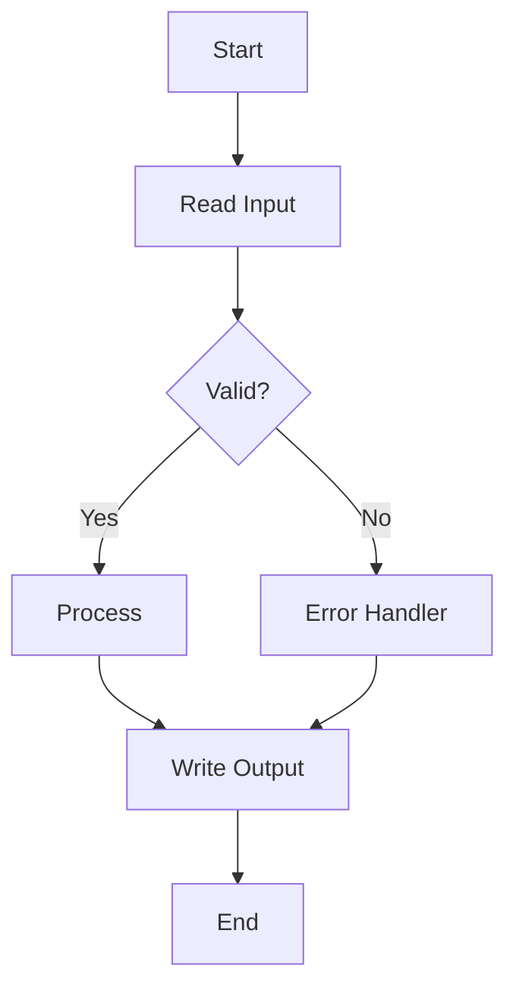

# Process Flow Documentation

## Flow Diagram

## Step Descriptions

### Step 1: [Name]
- **Input:** 
- **Process:** 
- **Output:** 
- **Error Handling:** 

## Dependencies
- Upstream: 
- Downstream: 

## Timing
- Frequency: 
- Duration: 
- SLA: 
